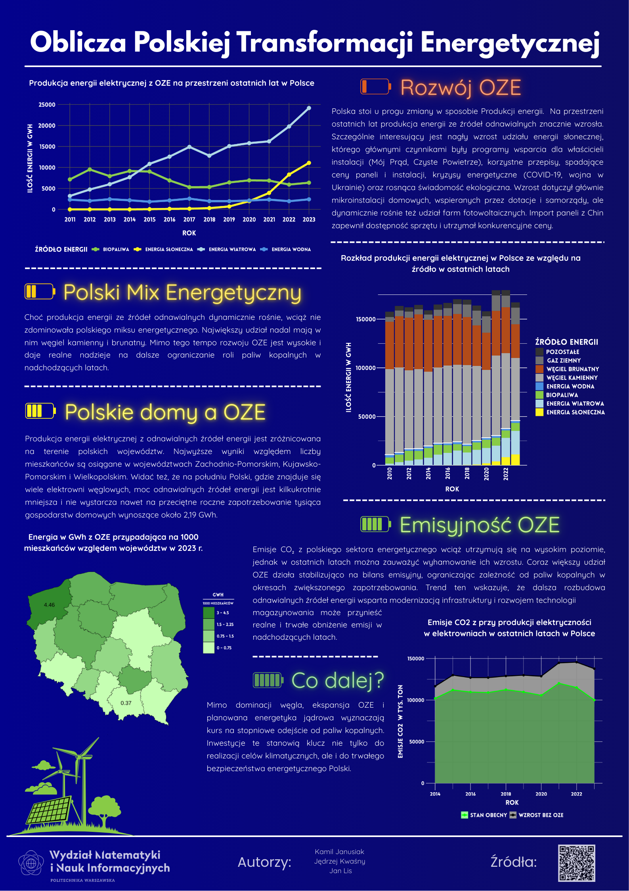

# TWD_Plakat
Autorzy:
Kamil Janusiak, Jan Lis, Jędrzej Kwaśny

Opis folderów:
- Dane: pliki potrzebne do wygenerowaniw wykresów/map m.in w formacie .csv
- Kody: pliki .R i czcionka potrzeben do wygenerowania wykresów
- Wykresy: wykresy w formacie .png, z których część znalazła się na plakacie

Dane
- [Moc OZE](https://pxweb.irena.org/pxweb/en/IRENASTAT/IRENASTAT__Power%20Capacity%20and%20Generation/Country_ELECSTAT_2025_H2_PX.px/?fbclid=IwY2xjawOP_DFleHRuA2FlbQIxMABicmlkETFJYkZOSFhQb3BUZTB0czFkc3J0YwZhcHBfaWQQMjIyMDM5MTc4ODIwMDg5MgABHkcuNrNZMEg9bXgBJDbLwv1jYo8xDAFmjWjxbWwli6xWncyVh17Fo1Ccxm9W_aem_5a7khDuEzGQaOrwl5QNUkQ)
- [Mix Energetyczny](https://dane.gov.pl/pl/dataset/1199,energetyka-polska/resource/67179/table?page=1&per_page=20&q=&sort=)
- [Produkcja energii w województwach](https://dane.gov.pl/pl/dataset/607,energia-elektryczna-i-ciepo-wg-wojewodztw/resource/67172/table)
- [Ludność w województwach](https://dane.gov.pl/en/dataset/4579/resource/61958,ludnosc-wedug-pci-i-wojewodztw-stan-w-dniu-31122023-roku/table)
- [Granice wojwództw](https://www.geoportal.gov.pl/pl/dane/panstwowy-rejestr-granic-prg/)
- [Emisje, moc](https://ec.europa.eu/eurostat/databrowser/view/nrg_bal_c/default/table?lang=en)
- [Emisje, emisje](https://ec.europa.eu/eurostat/databrowser/view/env_air_gge/default/table?lang=en)
- [Emisje, współczynniki emisji](https://www.kobize.pl/pl/fileCategory/id/28/wskazniki-emisyjnosci)

Plakat:

